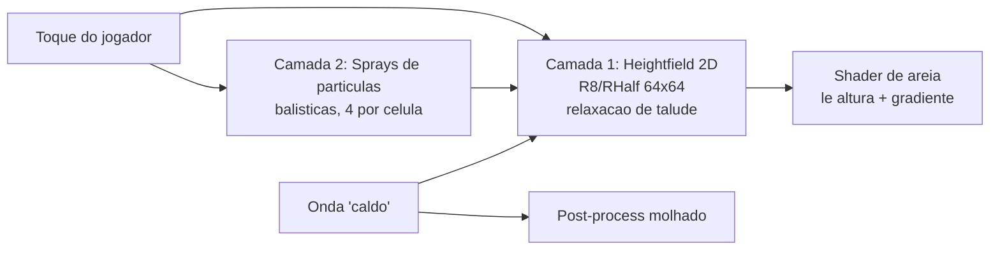

# Relatório — Areia granular (pbs-sandfluid) + Shaders Unity (Awesome-Unity-Shader) para TAPA BURACO

> Tudo abaixo é citado de código/PDF lidos nesta sessão. Onde eu deduzo (não li fonte), marco **[INFERÊNCIA]**.

---

# PARTE A — `boelukas/pbs-sandfluid`

## A.1 Identificação

| Item | Valor |
|---|---|
| Repo | https://github.com/boelukas/pbs-sandfluid |
| Licença | **MIT** (metadados GitHub + arquivo `LICENSE` na raiz) |
| Linguagem | Python + **Taichi** (`ti.init(arch=ti.gpu)`) + Open3D (visualização) |
| Contexto | Projeto final de *Physically-Based Simulation in Computer Graphics*, ETHZ HS2021 |
| Stars | 7 (projeto de curso, não biblioteca de produção) |
| Paper base | `docs/zhu-siggraph05-sandfluid.pdf` = Zhu & Bridson, **"Animating Sand as a Fluid"**, ACM TOG 24(3), 2005, pp. 965–972 |

README (raiz): *"We use Taichi to implement a fluid solver as described in the paper: Zhu, Yongning and Bridson, Robert, Animating sand as a fluid."*

## A.2 Método: **PIC / FLIP híbrido** — não é MPM, nem PBF, nem DEM

Resposta direta à pergunta:

- **Não é MPM.** O paper cita MPM apenas em Trabalhos Relacionados: *"Compressible FLIP was also extended to a elasto-plastic finite element formulation, the Material Point Method [Sulsky et al. 1995]"* — e explicitamente **rejeita** FEM/MPM: *"we would prefer to avoid the additional complexity and expense of FEM (which would require numerical quadrature, an implicit solver to avoid stiff time step restrictions due to elasticity, return mapping for plasticity, etc.)"* (§3.1).
- **Não é PBF/SPH.** O paper critica SPH: *"SPH methods in particular can't tolerate nonuniform particle spacing"* (§4.1).
- **Não é DEM.** *"scaling this up to just a handful of sand is clearly infeasible"* (§1) — abordagem é **contínuo**.
- **É PIC/FLIP** (Harlow 1963 / Brackbill & Ruppel 1986) adaptado a escoamento incompressível, com grid MAC escalonado auxiliar. Partículas são a representação fundamental; o grid só resolve interações espaciais (pressão, fronteiras, atrito).

Algoritmo do paper (§4.2, copiado do PDF):

```
- Initialize particle positions and velocities
- For each time step:
  - At each staggered MAC grid node, compute a weighted average of the nearby particle velocities
  - For FLIP: Save the grid velocities.
  - Do all the non-advection steps of a standard water simulator on the grid.
  - For FLIP: Subtract the new grid velocities from the saved velocities, then add the
    interpolated difference to each particle.
  - For PIC: Interpolate the new grid velocity to the particles.
  - Move particles through the grid velocity field with an ODE solver, making sure to push
    them outside of solid wall boundaries.
  - Write the particle positions to output.
```

## A.3 Modelo constitutivo: Mohr–Coulomb / Von Mises (cone tipo Drucker–Prager), fluxo **não-associado**

Drucker–Prager aparece **só** na revisão bibliográfica do paper (§2): *"a long history of numerically simulating granular materials using a elasto-plastic finite element formulation, with Mohr-Coulomb or Drucker-Prager yield conditions"*. O modelo **usado** é Mohr–Coulomb com cisalhamento equivalente de **Von Mises** — que na prática é um cone de Drucker–Prager suave. Nota de rodapé 1 do paper: *"Technically Mohr-Coulomb uses the Tresca definition of equivalent shear stress, but since it is not smooth and poses numerical difficulties, most people use Von Mises."*

### Equações do paper → funções reais do repo

| Paper | Equação | Implementação |
|---|---|---|
| (1) Escoamento (yield) | `√3·σ̄ < sinφ·σ_m`, com `σ_m = tr(σ)/3`, `σ̄ = |σ − σ_m δ|_F / √2` | `SandSolver.compute_rigid_sand_cells` |
| (2) Tensão friccional | `σ_f = −sinφ·p·D / (√(1/3)·|D|_F)` | `SandSolver.compute_frictional_stress` |
| (3) Tensão rígida | `σ_rigid = −ρ·D·Δx² / Δt` | `SandSolver.compute_rigid_stress` ⚠ **Δx² omitido** |
| (4) Atrito de fronteira | `u_T = max(0, 1 − μ|u·n|/|u_T|)·u_T` | ❌ **não implementado** |
| (5) Coesão | `√3·σ̄ < sinφ·σ_m + c` | ❌ **não implementado** (`c ≡ 0`) |

### Código real — condição de escoamento (`src/sand_solver.py`)

```python
    @ti.kernel
    def compute_rigid_sand_cells(self):
        for x, y, z in self.mac_grid.cell_rigid:
            if self.mac_grid.cell_type[x, y, z] == CellType.SAND.value:
                # yield condition
                sigma = self.mac_grid.rigid_stress[x, y, z]
                sigma_m = sigma.trace() / 3.0
                sigma_bar = self.frobenius_norm(sigma - sigma_m * self.delta) / ti.sqrt(
                    2.0
                )
                lhs = ti.sqrt(3.0) * sigma_bar
                rhs = ti.sin(self.internal_friction_angle) * sigma_m
                if lhs < rhs:
                    self.mac_grid.cell_rigid[x, y, z] = 1
                else:
                    self.mac_grid.cell_rigid[x, y, z] = 0
```

### Código real — tensão friccional (fluxo não-associado, direção `D`)

```python
    @ti.kernel
    def compute_frictional_stress(self):
        for x, y, z in self.mac_grid.frictional_stress:
            if self.mac_grid.cell_type[x, y, z] == CellType.SAND.value:
                norm_D = self.frobenius_norm(self.mac_grid.strain_rate[x, y, z])
                if norm_D > 1e-5:
                    self.mac_grid.frictional_stress[x, y, z] = (
                        -ti.sin(self.internal_friction_angle)
                        * self.mac_grid.pressure[x, y, z]
                        * (1.0 / ti.sqrt(1.0 / 3.0))
                        * (1.0 / norm_D)
                        * self.mac_grid.strain_rate[x, y, z]
                    )
```

`1.0 / ti.sqrt(1.0/3.0)` = √3 ≈ 1.7320508 — casa exatamente com a divisão por `√(1/3)` da eq. (2). O **limiar `norm_D > 1e-5`** é a guarda numérica contra divisão por zero: constante concreta a reaproveitar.

Racional físico (paper §3.1): *"Heuristically, this is just the classic Coulomb static friction law generalized to tensors… The coefficient of friction μ commonly used in Coulomb friction is replaced here by sinφ."* E sobre o fluxo não-associado: *"an associated flow rule would allow the material to shear if and only if it dilates proportionally — the more the sand flows, the more it expands… we confidently ignore it for animation."*

## A.4 Passos por frame (ordem exata)

`src/simulation.py`, `Simulation.advance(dt, t)` — copiado literal:

```python
    def advance(self, dt: ti.f32, t: ti.f32):
        self.mac_grid.particles_to_grid()
        self.mac_grid.save_velocities()

        # Non advection steps of fluid solver
        self.force_solver.compute_forces()
        self.force_solver.apply_forces(dt)
        self.pressure_solver.compute_pressure(dt)
        self.pressure_solver.project(dt)
        self.mac_grid.neumann_boundary_conditions()

        if self.sand_simulation:
            self.sand_solver.sand_steps(dt)

        self.mac_grid.grid_to_particles()
        self.mac_grid.advect_particles_midpoint(dt)
        self.mac_grid.update_cell_types()
```

E `SandSolver.sand_steps(dt)` (após zerar `strain_rate`, `frictional_stress_divergence`, `cell_rigid`, `frictional_stress`, `rigid_stress`):

```python
        self.compute_strain_rate()
        self.compute_frictional_stress()
        self.compute_rigid_stress(dt)
        self.compute_rigid_sand_cells()
        self.compute_stress_divergence()
        self.update_velocity_frictional_stess(dt)
```

**Ponto crítico de ordem:** os passos de areia rodam **depois** da projeção de pressão, porque `compute_frictional_stress` **consome `self.mac_grid.pressure`**. Isso é exigência do paper: *"If the resulting σ_rigid from equation 3 satisfies the yield condition (using the pressure we computed for incompressibility) we mark the grid cell as rigid"* (§3.2). Se você inverter a ordem no port, `p` vem zerado e a areia perde todo o atrito.

## A.5 Estruturas de dados (`src/macgrid.py`)

```python
class CellType(Enum):
    AIR = 0
    SAND = 1
    SOLID = 2
```

Campos, com shapes reais (`N = grid_size = 15`):

| Campo | Tipo | Shape | Papel |
|---|---|---|---|
| `cell_type` | `ti.f32` ⚠ (float p/ enum) | (N,N,N) | AIR/SAND/SOLID |
| `pressure`, `divergence` | `ti.f32` | (N,N,N) | centro de célula |
| `strain_rate` | `ti.Matrix.field(3,3)` | (N,N,N) | **D** |
| `frictional_stress` | `ti.Matrix.field(3,3)` | (N,N,N) | **σ_f** |
| `rigid_stress` | `ti.Matrix.field(3,3)` | (N,N,N) | **σ_rigid** |
| `frictional_stress_divergence` | `ti.f32` ⚠ **escalar** | (N,N,N) | deveria ser vetor |
| `cell_rigid` | `ti.i32` | (N,N,N) | marcação rígida |
| `v_x` / `v_y` / `v_z` | `ti.f32` | (N+1,N,N)/(N,N+1,N)/(N,N,N+1) | faces MAC |
| `v_*_saved` | `ti.f32` | idem | snapshot p/ FLIP |
| `f_x/f_y/f_z` | `ti.f32` | idem | forças |
| `splat_*_weights` | `ti.f32` | idem | normalização do splat |
| `particle_pos`, `particle_v`, `particle_edge_pos` | `ti.Vector.field(3)` | (2N,2N,2N) | partículas |
| `particle_active` | `ti.i32` | (2N,2N,2N) | 1 = ativa |

**Layout de partículas:** o campo é `(2N)³` — ou seja, **8 partículas por célula** endereçadas por subgrid 2×2×2, com `grid_idx = i // 2` e offset `0.25` (par) ou `0.75` (ímpar) + jitter:

```python
                    particle_pos_x = (
                        float(grid_idx_i) + 0.25 + ((ti.random(int) % 50) - 25) / 100.0
                    )
```

Jitter = `±0.25` célula. Isso implementa literalmente o paper §4.2.1: *"create 8 particles in every grid cell, randomly jittered from their 2 × 2 × 2 subgrid positions to avoid aliasing… With less particles per grid cell, we tend to run into occasional 'gaps' in the flow, and more particles allow for too much noise."* **Esse é o número mágico para o port: 8 em 3D ⇒ 4 (2×2) em 2D.**

Transferências: `splat()` é peso **trilinear** em 8 vizinhos (acumula em `target_field` e em `weights`, depois `v /= weight`); `sample()` é interpolação trilinear com offsets de escalonamento (`sample_x_edged` usa offset `(0, 0.5, 0.5)`, etc.). Advecção: `advect_particles_midpoint` = **RK2 midpoint de um único passo**, mais simples que o paper (§4.2.5: *"a simple RK2 ODE solver with five substeps each of which is limited by the CFL condition"*).

Mistura PIC/FLIP (`grid_to_particles`):

```python
                self.particle_v[i, j, k] = self.pic_fraction * pic_velocity + (
                    1.0 - self.pic_fraction
                ) * (self.particle_v[i, j, k] - flip_velocity)
```

## A.6 Parâmetros numéricos reais

| Parâmetro | Valor | Local |
|---|---|---|
| `internal_friction_angle` (φ) | **0.534 rad ≈ 30.6°** (comentário: *"between 30 to 45 deg in rad"*) | `sand_solver.py` |
| `density` (ρ) | `1.0` | `sand_solver.py` |
| `delta` (δ, tensor identidade) | `1.0` (escalar!) | `sand_solver.py` |
| guarda `|D|_F` | `1e-5` | `compute_frictional_stress` |
| `dt` | `1e-2` | `simulation.py` |
| `grid_size` | `15` | `simulation.py` |
| `initial_sand_cells` | `((5,10),(1,10),(5,10))` | `simulation.py` |
| `gaus_seidel_min_accuracy` | `1e-4` | `simulation.py` |
| `gaus_seidel_max_iterations` | `10000` | `simulation.py` |
| gravidade | `9.81` (literal `-= 9.81`, ignora `self.gravity`) | `force_solver.py` |
| `pic_fraction` (areia publicada) | **`1.0` = PIC puro** | `results/sand_simulation_settings` |
| `pic_fraction` (default no código) | `0.0` = FLIP puro | `simulation.py` |
| `rho` do solver de pressão | `1.0` | `pressure_solver.py` |

`pic_fraction = 1.0` para areia é escolha deliberada e vem do paper §4.2.4: *"For viscous flows, such as sand, the additional numerical viscosity of PIC is beneficial; for inviscid flows, such as water, FLIP is preferable."*

Desempenho original (paper §6, para calibrar expectativa): coelho = **269.322 partículas em grid 100³, ~6 s/frame** num G5 2 GHz; coluna = **433.479 partículas em 100×60×60, ~12 s/frame**; *"Our cost is essentially linearly proportional to the number of particles."* Atrito de fronteira usado nas figuras: **μ = 0.6** (legenda da Figura 2). Reconstrução de superfície: `R` = 2× espaçamento médio, kernel `k(s) = max(0, (1 − s²)³)` *"since it avoids the need for square roots"* (§5).

## A.7 Acoplamento areia↔fluido / mistura molhada: **NÃO EXISTE neste repo**

Evidências concretas:

1. `CellType` tem **apenas** `AIR`, `SAND`, `SOLID` — não há `FLUID`, `WET`, nem campo de saturação. O solver de água usa `CellType.SAND` como marcador de "tem fluido aqui": `compute_divergence`, `project`, `update_pressure` todos testam `== CellType.SAND.value`.
2. A diferença água↔areia é **um booleano**: `self.sand_simulation = False` em `simulation.py`, que liga/desliga `sand_solver.sand_steps(dt)`. Os `results/` confirmam: `pic_simulation_settings`, `flip_simulation_settings`, `sand_simulation_settings` são o **mesmo solver** com flags diferentes.
3. O título do paper ("Sand *as* a Fluid") é literal: *"we show that an existing water simulator can be turned into a sand simulator with only a few small additions to account for inter-grain and boundary friction."* (Abstract).

**Onde "areia molhada" está no paper:** apenas como referência a terceiros, §2: *"Carlson et al.[2002] added variable viscosity to a water solver, providing beautiful simulations of wet sand dripping (achieved simply by increased viscosity)."*

**Knobs fisicamente motivados para simular "molhado" sem novo solver** (derivados do paper, não do repo):
- **φ efetivo**: subir o ângulo de atrito interno (areia molhada compactada segura talude maior). Faixa legítima citada no comentário do repo: 30°–45° ⇒ `sinφ ∈ [0.500, 0.707]`.
- **Coesão `c > 0`** (eq. 5) — é exatamente o mecanismo de "grudar". O paper §3.4: *"including a very small amount of cohesion improves our results for supposedly cohesion-less materials like sand… a tiny amount of cohesion counters this error and makes the sand stable again, without visibly effecting the flow when the sand should be moving."* Para o jogo: `c = lerp(c_seca_pequena, c_molhada, molhado)`.
- **`pic_fraction`** como proxy de viscosidade: seca → mais FLIP; molhada → PIC puro (1.0).

## A.8 Lacunas do repo vs. o paper (importantíssimo antes de portar)

1. **Projeção de grupos rígidos AUSENTE.** O paper exige: *"We then find all connected groups of rigid cells, and project the velocity field in each separate group to the space of rigid body motions (i.e. find a translational and rotational velocity which preserve the total linear and angular momentum of the group)."* No repo, `cell_rigid` é **código morto**: gravado em `compute_rigid_sand_cells`, lido **apenas** por `MacGrid.show_rigid_cells()` (plot matplotlib de depuração). Nenhum kernel de física lê `cell_rigid`. ⇒ **A pilha de areia do repo nunca fica realmente rígida.** Esse é o motivo mais provável de o resultado parecer "lama viscosa" e não "pilha estável". **[INFERÊNCIA]** sobre a causa visual; o fato do código morto é verificado.
2. **Atrito de fronteira (eq. 4) AUSENTE.** `neumann_boundary_conditions` só zera as velocidades normais nas bordas. O paper alerta: *"This is a crucial addition to a fluid solver, since the boundary conditions previously discussed in the animation literature either don't permit any kind of sliding (u = 0) which means sand sticks even to vertical surfaces, or always allow sliding… which means sand piles will never be stable."*
3. **Coesão (eq. 5) AUSENTE** (`c ≡ 0`).
4. **`Δx²` faltando em `σ_rigid`**: repo faz `-self.density * (1.0/dt) * D`; eq. (3) é `−ρ·D·Δx²/Δt`. Como `Δx = 1` na indexação do repo, o valor numérico coincide — mas **o port para 2D com Δx físico ≠ 1 vai quebrar silenciosamente**.
5. **`frictional_stress_divergence` é escalar.** ∇·σ_f é vetor (3 componentes). O kernel soma as três somas de coluna num único float:

```python
            self.mac_grid.frictional_stress_divergence[x, y, z] = (
                dsig_dx_col_sum + dsig_dy_col_sum + dsig_dz_col_sum
            )
```
E `update_velocity_frictional_stess` aplica esse **mesmo escalar** a `v_x`, `v_y` e `v_z` (só mudando o offset do vizinho). Isso **não** é `u += Δt/ρ ∇·σ_f`. Trate como bug/simplificação — **não replique**. **[INFERÊNCIA]** na classificação como bug; o código é verificado.
6. **Sem extrapolação de velocidade / fast sweeping.** Paper §4.2.3 usa campo de distância + `∇u·∇φ = 0` por fast sweeping antes e depois da projeção; o repo não tem nada disso, e `update_pressure` conta vizinhos por **posição no grid** (`if x != 1 and x != grid_size-1`), ignorando se o vizinho é AIR. Não há condição de superfície livre `p = 0`.
7. **`project()` usa `* dt`** em vez de `* dt/(ρ·Δx)` — consistente com `ρ=1, Δx=1` mas não dimensional.
8. **Gauss-Seidel sequencial até 10.000 iterações** — inviável em tempo real.
9. **Procedência do código:** `src/macgrid.py` declara no docstring *"The skeleton was inspired by https://github.com/Wimacs/taichi_code/blob/master/flip%26apic%26pic/pic_flip.py"* e várias funções marcam *"Taken from 4_fluid.py 252-0546-00L ETH Physically-Based Simulation in Computer Graphics course exercise"*. Ver §D.1.

---

# PARTE A' — RECEITA IMPLEMENTÁVEL: areia granular 2D barata para TAPA BURACO

**Tese central:** *não porte PIC/FLIP.* O que dá a "cara" de areia é o **critério de escoamento de Mohr–Coulomb**, e em um campo de altura 2.5D esse critério colapsa num **limite de talude** (ângulo de repouso). Uma malha 3D de pressão + Gauss-Seidel é 100% desperdício para 28 buracos numa praia vista de cima.

## R.1 Duas camadas



- **Camada 1 — Heightfield + relaxação de talude** (sempre ligada; substitui o solver inteiro).
- **Camada 2 — Sprays balísticos** (só durante "cavar"/"tapar"/onda; puramente visual, devolve massa ao heightfield na aterrissagem).

## R.2 Camada 1 — o critério de areia, em 2D e sem solver de pressão

### Constantes derivadas do repo/paper (números reais, não inventados)

| Símbolo | Valor | Origem |
|---|---|---|
| φ | `0.534 rad` | `sand_solver.py` |
| `sin φ` | `0.50904` | idem |
| **`tan φ`** | **`0.59180`** | idem → **ângulo de repouso** |
| φ molhada | `0.785 rad (45°)` | topo da faixa no comentário do repo |
| `tan φ_molhada` | `1.0` | idem |
| Partículas/célula | **4** (2×2 em 2D) | paper §4.2.1 (8 = 2³ em 3D) |
| Jitter | `±0.25` célula | `init_particles` |
| `pic_fraction` areia | `1.0` | `sand_simulation_settings` |
| μ fronteira | `0.6` | paper Fig. 2 |
| ε de `|D|` | `1e-5` | `compute_frictional_stress` |

### Kernel de relaxação (o único passo de física que você precisa)

Para cada célula `c` com altura `h[c]`, vizinhos 4-conectados `n`, `Δx` = tamanho da célula em unidades de mundo:

```
slopeMax = tanPhi * dx            // 0.59180 * dx  (areia seca)
excess   = (h[c] - h[n]) - slopeMax
se excess > 0:
    move = 0.5 * excess * relaxRate     // relaxRate ~ 0.25..0.5
    h[c] -= move ;  h[n] += move
```

Por que isso é o modelo do paper e não um hack: no limite de campo de altura, `D` (taxa de deformação) de uma coluna deslizante é proporcional ao gradiente de altura, e `√3σ̄ < sinφ·σ_m` ⇒ *"a material não cede enquanto a inclinação estiver abaixo do ângulo de atrito"*. `tan φ` é a forma 1D do mesmo cone. Conservação de massa é exata (soma-zero por par), o que o repo **não** garante (ele nem tem controle de massa).

**Molhado:** `tanPhi = lerp(0.59180, 1.0, wetness)`.  
**Coesão (eq. 5):** adicione `cohesion` ao limiar: `slopeMax = tanPhi*dx + cohesion`. Justificativa no paper §3.4 (citada em A.7). Comece com `cohesion = 0.02*dx`.  
**Borda do buraco:** ao "cavar", **não** relaxe as células marcadas como borda de buraco no mesmo frame — senão o buraco se autofecha. Use uma máscara de 1 bit.

### Números de custo (grid 64×64 cobrindo o triângulo de 7 fileiras)

- 4096 células × 4 vizinhos × 4 iterações/frame = **65.536 pares/frame**.
- Compute shader: `[numthreads(8,8,1)]` ⇒ `Dispatch(8, 8, 1)` (8 = 64/8) = **64 thread groups**, ocupação perfeita em Adreno/Mali (múltiplo de 64/wave). Use 2 RTs `RFloat` (ou `R16_UNorm` se a faixa de altura for limitada) em ping-pong, `enableRandomWrite = true`. Aplique o padrão **checkerboard (red/black)**: 2 despachos por iteração alternando `(x+y)%2`, para evitar a corrida de leitura/escrita do par — o repo escapa disso porque Taichi serializa Gauss-Seidel na CPU. **[INFERÊNCIA]** na escolha do padrão checkerboard; é a solução padrão para relaxação paralela.
- Alternativa CPU/Burst: `NativeArray<float>` 4096 floats, `IJobParallelFor` sobre linhas, `[BurstCompile]`. 65k operações float/frame é ruído (<0.1 ms) — **prefira esta** se você não precisa do heightfield na GPU por outro motivo. Mas você **precisa** dele na GPU para o shader de areia ler, então um `Texture2D` 64×64 R8 com `SetPixelData`+`Apply(false)` por frame custa 4 KB de upload — trivial. **[INFERÊNCIA]** nas medidas de tempo (não executadas).
- **Regra prática:** 64×64 R8 = 4 KB. Não use 256×256 (64 KB + 16× o trabalho) — a 7 fileiras / 28 buracos você não tem detalhe geométrico que justifique.

### Substepping

O repo usa `dt = 1e-2` (100 Hz). Em 60 fps (`dt = 0.01667`) faça **2 substeps de 0.00833** para ficar abaixo de `1e-2` e manter o mesmo regime de estabilidade dos resultados publicados. A relaxação de talude é incondicionalmente estável para `relaxRate ≤ 0.5` **[INFERÊNCIA]**, então isso é conservador.

## R.3 Camada 2 — sprays balísticos (o "grão" visível)

O que reter do repo: **contagem e jitter de partículas**, não a física.

- **4 partículas por célula afetada** (2×2 subgrid + jitter `±0.25`). Cavar 1 buraco toca ~9 células ⇒ **~36 partículas por toque**. Onda cobrindo 400 células ⇒ ~1600 partículas: dentro de orçamento para um único `ParticleSystem` ou mesh instanciado.
- Física: **balística pura** `v += g*dt; p += v*dt` com `g = 9.81` (valor do repo). **Zero** interação partícula-partícula, zero pressão. Na colisão com o heightfield (`p.y < h(p.xz)`), deposite `massa/4` no heightfield e mate a partícula — a relaxação de talude cuida do resto e a pilha se forma com o ângulo correto **de graça**.
- Amortecimento tangencial na aterrissagem usando o atrito de fronteira do paper (eq. 4) com `μ = 0.6`:
  ```
  vT *= max(0, 1 - 0.6 * abs(dot(v, n)) / max(length(vT), 1e-5))
  ```
  (o `1e-5` reaproveita a guarda do repo). Isso é literalmente a fórmula (4) — areia que **para** no talude em vez de escorregar para sempre.

## R.4 O que NÃO portar (e por quê)

| Componente do repo | Veredito |
|---|---|
| `PressureSolver` (Gauss-Seidel, 10.000 it.) | ❌ Descarte. Sem incompressibilidade, sem pressão. Heightfield conserva massa por construção. |
| `frictional_stress` 3×3 por célula | ❌ Descarte. 9 floats/célula; em 2.5D o gradiente de altura substitui. |
| `compute_stress_divergence` | ❌ Descarte (e está errado — ver A.8.5). |
| `particles_to_grid` / `grid_to_particles` (splat trilinear, 8 vizinhos) | ❌ Descarte para gameplay. É o gargalo real (paper §6: custo ∝ nº de partículas). |
| `advect_particles_midpoint` (RK2) | ⚠ Opcional. Euler explícito basta para spray balístico visual. |
| **Condição de escoamento `√3σ̄ < sinφσ_m`** | ✅ **Porte como limite de talude `tan φ`.** |
| **`sinφ`/`tanφ` = 0.509/0.5918; coesão eq.5; μ=0.6 eq.4** | ✅ **Porte as constantes.** |
| **4 partículas/célula + jitter ±0.25** | ✅ **Porte.** |
| **`pic_fraction = 1.0` para areia** | ✅ Traduza como "amortecimento alto" nos sprays. |

## R.5 Rastros / deformação por altura (pegadas, mão cavando, arrasto da onda)

O heightfield da Camada 1 **é** o buffer de deformação. Um único `RenderTexture` 64×64 serve simultaneamente para: (a) física da areia, (b) deslocamento de vértice, (c) sombreamento.

- `Shader.SetGlobalTexture("_SandHeight", heightRT)` + `SetGlobalVector` com o retângulo mundo→UV.
- No shader: normal por diferenças centrais **4 taps** (mesmo esquema do `compute_strain_rate` do repo, que usa diferenças de faces vizinhas):
  ```
  float hL = SAMPLE(_SandHeight, uv - float2(tex.x,0)).r;
  float hR = SAMPLE(_SandHeight, uv + float2(tex.x,0)).r;
  float hD = SAMPLE(_SandHeight, uv - float2(0,tex.y)).r;
  float hU = SAMPLE(_SandHeight, uv + float2(0,tex.y)).r;
  float3 n = normalize(float3(hL-hR, 2.0*_HeightScale*tex.x, hD-hU));
  ```
  Custo: **4 taps + 1 normalize**. Não use Sobel 8-tap aqui — dobra o custo sem ganho visível num cartaz serigráfico.
- Sombra do buraco: `saturate(-h * _HoleDarken)` multiplicando o albedo. Um buraco na areia é 90% **sombra**, não geometria — em um jogo 2D/ortográfico você pode até dispensar deslocamento de vértice e ficar só com a sombra + contorno grosso.

---

# PARTE B — `QianMo/Awesome-Unity-Shader`

## B.0 Leitura honesta do índice

Apesar do nome, **não é uma "awesome list" de links curados**. É o repositório de código da coluna de blog *《浅墨Unity3D Shader编程》* do QianMo (CSDN), com 16 volumes de shaders **Built-in pipeline / CGPROGRAM**, escritos entre 2014 e 2017. Consequências práticas, verificadas no código:

- Usam `mul(UNITY_MATRIX_MVP, v.vertex)` (removido/deprecado; hoje `UnityObjectToClipPos` no Built-in ou `TransformObjectToHClip` no URP).
- `#pragma surface surf Lambert` / `SurfaceOutput` — **Surface Shaders não existem no URP**.
- `fixed4 frag(...) : COLOR` (semântica antiga, hoje `SV_Target`).
- Efeitos de tela vêm como `OnRenderImage`/`Graphics.Blit` (`*.cs`), padrão incompatível com o URP de Unity 6. **[INFERÊNCIA]** quanto às substituições exatas no Unity 6 (não li a doc do URP nesta sessão); o que li e verifico é o código legado no repo.

O próprio README indica a saída: recomenda **X-PostProcessing Library (XPL)**, MIT, do mesmo autor — código muito mais novo (`Copyright (C) 2020`), já em HLSL com `SAMPLE_TEXTURE2D`/`VaryingsDefault`. Mas **atenção**: a árvore `Assets/X-PostProcessing/` = `{Editor, Effects, Profiles, Resources, Shaders, Utility}` — **não existe pasta URP/LWRP/HDRP**. O README ainda diz *"More effects and LWRP/URP/HDRP version will arrive soon."* ⇒ **XPL é Post Processing Stack v2 puro**; você reaproveita o **HLSL do fragmento**, não o wrapper C#.

## B.1 Lista curada — 12 técnicas, com link direto e custo

Custo medido em **taps** (amostras de textura por pixel), o número que importa em Adreno/Mali. Referência: a 1080×1920 em full-res, **1 tap fullscreen ≈ 2 M amostras/frame**; a meia resolução, 0,5 M.

### (a) Água estilizada de praia / espuma

**1. `ScreenWaterDropEffect` — "levou um caldo"** ⭐ melhor custo-benefício do repo  
[`Volume 09 .../ScreenWaterDropEffect/ScreenWaterDropEffect.shader`](https://github.com/QianMo/Awesome-Unity-Shader/blob/master/Volume%2009%20%E5%B1%8F%E5%B9%95%E6%B0%B4%E5%B9%95%E7%89%B9%E6%95%88Shader%26Standard%20Shader/ScreenWaterDropEffect/ScreenWaterDropEffect.shader)  
Três camadas de textura de gota em UVs deslocados + 1 sample distorcido da cena:
```hlsl
float3 rainTex1 = tex2D(_ScreenWaterDropTex, float2(uv.x * 1.15* _SizeX, (uv.y* _SizeY *1.1) + _CurTime* _DropSpeed *0.15)).rgb / _Distortion;
float3 rainTex2 = tex2D(_ScreenWaterDropTex, float2(uv.x * 1.25* _SizeX - 0.1, (uv.y *_SizeY * 1.2) + _CurTime *_DropSpeed * 0.2)).rgb / _Distortion;
float3 rainTex3 = tex2D(_ScreenWaterDropTex, float2(uv.x* _SizeX *0.9, (uv.y *_SizeY * 1.25) + _CurTime * _DropSpeed* 0.032)).rgb / _Distortion;
float2 finalRainTex = uv.xy - (rainTex1.xy - rainTex2.xy - rainTex3.xy) / 3;
```
**Custo: 4 taps** (3 da máscara + 1 dependente da cena). **Mobile: ótimo.** Ressalvas: o sample da cena é *dependent texture read* (UV calculado no fragment) — em GPUs móveis isso impede prefetch; a 3 camadas ainda é barato. Bug real a corrigir no port: o shader **escreve em `_DropSpeed`** (uniform) dentro do `#if UNITY_UV_STARTS_AT_TOP` — copie para uma local.  
**Uso no TAPA BURACO:** só durante o "caldo" (≤1 s), com `_CurTime` animado e fade-out. Ligue/desligue a feature; nunca deixe sempre ativo.

**2. `RapidBlurEffect` — base para espuma/glow de arrebentação**  
[`Volume 15 .../RapidBlurEffect.shader`](https://github.com/QianMo/Awesome-Unity-Shader/blob/master/Volume%2015%20%E5%B1%8F%E5%B9%95%E9%AB%98%E6%96%AF%E6%A8%A1%E7%B3%8A(Gaussian%20Blur)%E7%89%B9%E6%95%88%E7%9A%84%E5%AE%9E%E7%8E%B0/RapidBlurEffect.shader) + [`RapidBlurEffect.cs`](https://github.com/QianMo/Awesome-Unity-Shader/blob/master/Volume%2015%20%E5%B1%8F%E5%B9%95%E9%AB%98%E6%96%AF%E6%A8%A1%E7%B3%8A(Gaussian%20Blur)%E7%89%B9%E6%95%88%E7%9A%84%E5%AE%9E%E7%8E%B0/RapidBlurEffect.cs)  
Gaussiano separável com downsample. **Custo: ~5 taps/passe × 2 eixos × N iterações, em resolução reduzida.**  
**Mobile: aceitável a ¼ de resolução** (downSample ≥ 2). **Recomendação objetiva:** troque por **`DualKawaseBlur` do XPL** — dual-filter (down+up) é o padrão de blur mobile e o próprio autor escreveu o artigo comparando os 10 algoritmos: [Dual Kawase Blur](https://github.com/QianMo/X-PostProcessing-Library/tree/master/Assets/X-PostProcessing/Effects/DualKawaseBlur), artigo: [*高品质后处理：十种图像模糊算法的总结与实现*](https://zhuanlan.zhihu.com/p/125744132).

**3. `MotionBlurEffects` (radial blur) — impacto da onda**  
[`Volume 08 .../MotionBlurEffects/MotionBlurEffects.shader`](https://github.com/QianMo/Awesome-Unity-Shader/blob/master/Volume%2008%20%E5%BE%84%E5%90%91%E6%A8%A1%E7%B3%8A%E5%B1%8F%E5%B9%95%E7%89%B9%E6%95%88Shader%26%E8%87%AA%E5%AE%9A%E4%B9%89Shader%20template/MotionBlurEffects/MotionBlurEffects.shader) — equivalente XPL: [RadialBlurV2](https://github.com/QianMo/X-PostProcessing-Library/tree/master/Assets/X-PostProcessing/Effects/RadialBlurV2)  
**Custo: N taps em loop radial** (tipicamente 6–12). **Mobile: só como flash momentâneo**, meia-res, `_Iteration ≤ 6` e desenrolado.

### (b) Areia (specular granular, rastros/deformação por altura)

**4. MatCap (`CarPaintShader`) — specular granular de areia por 2 dots** ⭐  
[`Volume 16 .../CarPaintShader.shader`](https://github.com/QianMo/Awesome-Unity-Shader/blob/master/Volume%2016%20%E5%9F%BA%E4%BA%8EMatCap%E5%AE%9E%E7%8E%B0%E9%AB%98%E7%9C%9F%E5%AE%9E%E6%84%9F%E8%BD%A6%E6%BC%86Shader/CarPaintShader.shader)  
O título do volume no README é literalmente *"基于MatCap实现**适于移动平台**的'次时代'车漆Shader"* ("adequado a plataformas móveis"). O núcleo, **no vertex shader**:
```hlsl
output.diffuseUVAndMatCapCoords.z = dot(normalize(UNITY_MATRIX_IT_MV[0].xyz), normalize(input.normal));
output.diffuseUVAndMatCapCoords.w = dot(normalize(UNITY_MATRIX_IT_MV[1].xyz), normalize(input.normal));
output.diffuseUVAndMatCapCoords.zw = output.diffuseUVAndMatCapCoords.zw * 0.5 + 0.5;
```
e no fragment: `tex2D(_MatCap, ...zw).rgb` com `mainColor * matCapColor * 2.0`.  
**Custo no fragment: 1 tap** (o MatCap) — o resto (cubemap + detail + diffuse) você **descarta**. 2 dots + 3 normalize no vertex.  
**Mobile: excelente.** Codifique o brilho granular da areia no MatCap (textura 128×128 basta) e você ganha specular anisotrópico de graça, sem luz real, sem cubemap, sem `texCUBE`. **Descarte `_ReflectionMap` (samplerCUBE) e `_DetailTexDepthOffset`** — 1 cubemap fetch em Mali por pixel não se paga num cartaz.

**5. Rampa toon (`LightingRamp`) — banding de serigrafia na areia e no mar**  
[`Volume 07 .../4.自定义卡通渐变光照.shader`](https://github.com/QianMo/Awesome-Unity-Shader/blob/master/Volume%2007%20%E8%A1%A8%E9%9D%A2%E7%9D%80%E8%89%B2%E5%99%A8%E7%9A%84%E5%86%99%E6%B3%95(%E4%BA%8C)-%E8%87%AA%E5%AE%9A%E4%B9%89%E5%85%89%E7%85%A7%E6%A8%A1%E5%BC%8F/4.%E8%87%AA%E5%AE%9A%E4%B9%89%E5%8D%A1%E9%80%9A%E6%B8%90%E5%8F%98%E5%85%89%E7%85%A7.shader) (e a variante [v2](https://github.com/QianMo/Awesome-Unity-Shader/blob/master/Volume%2007%20%E8%A1%A8%E9%9D%A2%E7%9D%80%E8%89%B2%E5%99%A8%E7%9A%84%E5%86%99%E6%B3%95(%E4%BA%8C)-%E8%87%AA%E5%AE%9A%E4%B9%89%E5%85%89%E7%85%A7%E6%A8%A1%E5%BC%8F/5.%E8%87%AA%E5%AE%9A%E4%B9%89%E5%8D%A1%E9%80%9A%E6%B8%90%E5%8F%98%E5%85%89%E7%85%A7v2.shader))
```hlsl
half NdotL = dot (s.Normal, lightDir); 
half diff = NdotL * 0.5 + 0.5;
half3 ramp = tex2D (_Ramp, float2(diff,diff)).rgb;
color.rgb = s.Albedo * _LightColor0.rgb * ramp * (atten * 2);
```
**Custo: 1 tap extra.** **Mobile: excelente.** É a forma canônica de obter 3–4 patamares de cor (`#E9D3A8` → `#D3B786`) com transições duras de serigrafia.  
⚠ **É Surface Shader** (`#pragma surface surf Ramp`): reescreva como fragment URP. A rampa `_Ramp` deve ser **256×1, Filter=Point, Wrap=Clamp, sRGB** para os degraus não vazarem. **[INFERÊNCIA]** nos ajustes de import.

**6. Rim (`SurfaceRimShader`) — halo de luz de sol na crista da areia**  
[`Volume 14 .../SurfaceRimShader.shader`](https://github.com/QianMo/Awesome-Unity-Shader/blob/master/Volume%2014%20%E8%BE%B9%E7%BC%98%E5%8F%91%E5%85%89Shader(Rim%20Shader)%E7%9A%84%E4%B8%A4%E7%A7%8D%E5%AE%9E%E7%8E%B0%E5%BD%A2%E6%80%81/SurfaceRimShader.shader) (variante sem Surface Shader: [`BasicRimShader.shader`](https://github.com/QianMo/Awesome-Unity-Shader/blob/master/Volume%2014%20%E8%BE%B9%E7%BC%98%E5%8F%91%E5%85%89Shader(Rim%20Shader)%E7%9A%84%E4%B8%A4%E7%A7%8D%E5%AE%9E%E7%8E%B0%E5%BD%A2%E6%80%81/BasicRimShader.shader))
```hlsl
half rim = 1.0 - saturate(dot(normalize(IN.viewDir), o.Normal));
o.Emission = _RimColor.rgb * pow(rim, _RimPower)*_RimIntensity;
```
**Custo: 1 dot + 1 pow, 0 taps.** **Mobile: trivial.**  
⚠ **Não é outline de cartaz.** Rim tem espessura variável com a curvatura; contorno de serigrafia é constante. Use para brilho, não para contorno. Descarte o `_BumpMap` (1 tap + UnpackNormal) se a areia usa normal por heightfield (§R.5).

### (c) Pós-processamento papel / grão / halftone / serigrafia

**7. `PixelEffect` — quantização de UV, base de retícula** 
[`Volume 11 .../PixelEffect/PixelEffect.shader`](https://github.com/QianMo/Awesome-Unity-Shader/blob/master/Volume%2011%20%E5%B1%8F%E5%B9%95%E5%83%8F%E7%B4%A0%E5%8C%96%E7%89%B9%E6%95%88Shader/PixelEffect/PixelEffect.shader)
```hlsl
half PixelSize = 1.0 / scale;
half coordX = PixelSize * ceil(uv.x / PixelSize);
half coordY = (ratio * PixelSize)* ceil(uv.y / PixelSize / ratio);
```
Default: `_Params("PixelNumPerRow (X) Ratio (Y)", Vector) = (80, 1, 1, 1.5)`.  
**Custo: 1 tap + 2 ceil + 2 div.** **Mobile: trivial.**  
⚠ **`ceil` (não `floor`) desloca meio bloco**; e como o UV é calculado no fragment, o hardware **não escolhe mip** corretamente — force `tex2Dlod`/`SAMPLE_TEXTURE2D_LOD(..., 0)` ou aceite aliasing. Para halftone real você combina essa quantização de célula com um threshold sobre a luminância (`step(lum, patternValue)`) — **1 tap adicional se o padrão vier de textura, 0 taps se procedural**.

**8. `PixelizeHexagonGrid` (XPL) — retícula hexagonal de risografia** 
[`Assets/X-PostProcessing/Effects/PixelizeHexagonGrid/Shader/PixelizeHexagonGrid.shader`](https://github.com/QianMo/X-PostProcessing-Library/blob/master/Assets/X-PostProcessing/Effects/PixelizeHexagonGrid/Shader/PixelizeHexagonGrid.shader)  
Constantes reais do código: `s = 0.5`, `c = 0.8660254` (= √3/2), `r = 0.8660254*s`; `interior = 1.0 - smoothstep(interiorSize - 0.8, interiorSize, dist * _GridWidth)` dá a grade entre hexágonos.  
**Custo: 1 tap + `NearestHex()` com 6 branches + `fmod`/`floor`.** **Mobile: cuidado** — o tap count engana; o custo real está na divergência de branches. Em Mali/Adreno, 6 branches por pixel fullscreen custa mais que 4 taps extras. **Recomendação: pré-renderize o padrão hexagonal numa textura tileável 64×64 e faça 1 tap**, em vez de calcular `NearestHex` por pixel. O visual "papel de pão"/risografia não precisa de exatidão hexagonal.

**9. `GrainyBlur` (XPL) — grão de impressão** 
[`.../GrainyBlur/Shader/GrainyBlur.shader`](https://github.com/QianMo/X-PostProcessing-Library/blob/master/Assets/X-PostProcessing/Effects/GrainyBlur/Shader/GrainyBlur.shader)
```hlsl
float Rand(float2 n) { return sin(dot(n, half2(1233.224, 1743.335))); }
...
for (int k = 0; k < int(_Iteration); k ++) {
    random = frac(43758.5453 * random + 0.61432);
    randomOffset.x = (random - 0.5) * 2.0;
    ...
    finalColor += SAMPLE_TEXTURE2D(_MainTex, sampler_MainTex, half2(i.texcoord + randomOffset * _BlurRadius));
}
return finalColor / _Iteration;
```
**Custo: `_Iteration` taps aleatórios** (cache-hostis) **+ loop dinâmico**. **Mobile: ruim como está.**  
**Recomendação objetiva:** para grão de serigrafia você **não quer blur** — quer **ruído aditivo**. Descarte o loop e use só `Rand()` (constantes `1233.224/1743.335/43758.5453/0.61432` são reutilizáveis) como **grão de 0 taps**: `color += (Rand(uv*_Time.y) - 0.5) * _GrainAmount`. Ou melhor ainda: **1 tap de uma textura de grão tileável** em `Repeat`, que é estável temporalmente (ruído procedural cintila e é péssimo em vídeo comprimido da loja).

**10. `ScreenOilPaintEffect` (Kuwahara 2 setores) — pincelada/serigrafia** ⚠ **caro**  
[`Volume 10 .../ScreenOilPaintEffect.shader`](https://github.com/QianMo/Awesome-Unity-Shader/blob/master/Volume%2010%20%E5%B1%8F%E5%B9%95%E6%B2%B9%E7%94%BB%E7%89%B9%E6%95%88Shader/ScreenOilPaintEffect/ScreenOilPaintEffect.shader)  
Dois setores (`-R..0` e `0..R`), calculando média `m` e variância `s` e escolhendo o de menor `sigma2`:
```hlsl
float n = float((_Radius + 1) * (_Radius + 1));
for (int j = -_Radius; j <= 0; ++j) for (int i = -_Radius; i <= 0; ++i) { c = tex2D(...); m0 += c; s0 += c*c; }
...
m0 /= n;  s0 = abs(s0 / n - m0 * m0);
float sigma2 = s0.r + s0.g + s0.b;
if (sigma2 < min_sigma2) { min_sigma2 = sigma2; finalFragColor = float4(m0, 1.0); }
```
**Custo: `2·(R+1)²` taps.** `_Radius` é `Range(0,5)`, default **2 ⇒ 18 taps**; `R=5 ⇒ 72 taps`. A 1080p full-res, R=2 = **~37 M amostras/frame**.  
**Mobile: NÃO use fullscreen.** Se quiser o look: (a) rode a **¼ de resolução** (18 taps × 0,5 M = 9 M) e faça upsample, ou (b) — muito melhor — **asse o efeito offline nas texturas de arte** no seu pipeline de autoria. Um cartaz estático não precisa de Kuwahara em tempo real.  
⚠ **Licença: header diz `//Reference:https://www.shadertoy.com/view/MsXSRN#` → ver §D.2.**

### (d) Contorno grosso estilo cartaz (outline)

**11. `EdgeDetectionSobel` (XPL) — contorno de cartaz, espessura controlável** ⭐ melhor casamento estético  
[`.../EdgeDetectionSobel/Shader/EdgeDetectionSobel.shader`](https://github.com/QianMo/X-PostProcessing-Library/blob/master/Assets/X-PostProcessing/Effects/EdgeDetectionSobel/Shader/EdgeDetectionSobel.shader)  
Já faz exatamente o que o cartaz pede — tinta preta sobre fundo desbotado:
```hlsl
half4 backgroundColor = lerp(sceneColor, _BackgroundColor, _BackgroundFade);
float3 edgeColor = lerp(backgroundColor.rgb, _EdgeColor.rgb, sobelGradient);
```
com espessura em pixels: `sobel(_EdgeWidth/_ScreenParams.x, _EdgeWidth/_ScreenParams.y, i.texcoord)` e kernel documentado no próprio arquivo:
```
//        1 0 -1     -1 -2 -1
//    X = 2 0 -2  Y = 0  0  0
//        1 0 -1      1  2  1
```
**Custo: 8 taps + 8 `sqrt` (dentro de `intensity()`) + 1 `sqrt` final = 9 sqrt/pixel.** **Mobile: pesado como está.**  
**Duas otimizações obrigatórias:**
1. `intensity()` faz `sqrt(r²+g²+b²)` por tap. **Troque por `dot(color.rgb, half3(0.299,0.587,0.114))`** → elimina 8 `sqrt`.
2. `sobelGradient = sqrt(Gx*Gx+Gy*Gy)` → use `abs(Gx)+abs(Gy)` (norma L1) → elimina o 9º `sqrt`. Para contorno grosso e binarizado a diferença é invisível.
   Resultado: **8 taps, 0 sqrt**. Rode a **meia resolução** e o contorno fica *mais* grosso (o que você quer) enquanto custa **¼** — 8 taps × 0,5 M = 4 M amostras.

**12. `EdgeDetectionRoberts` (XPL) — metade do custo do Sobel**  
[`.../Effects/EdgeDetectionRoberts`](https://github.com/QianMo/X-PostProcessing-Library/tree/master/Assets/X-PostProcessing/Effects/EdgeDetectionRoberts) (família completa: [Sobel](https://github.com/QianMo/X-PostProcessing-Library/tree/master/Assets/X-PostProcessing/Effects/EdgeDetectionSobel), [Roberts](https://github.com/QianMo/X-PostProcessing-Library/tree/master/Assets/X-PostProcessing/Effects/EdgeDetectionRoberts), [Scharr](https://github.com/QianMo/X-PostProcessing-Library/tree/master/Assets/X-PostProcessing/Effects/EdgeDetectionScharr), + variantes `Neon`/`NeonV2` de cada)  
**Custo: 4 taps** (cruz diagonal 2×2) vs. 8 do Sobel. **Mobile: bom.** Roberts é mais sensível a ruído — mas sua cena é *flat color* de cartaz, com pouquíssimo ruído de alta frequência, então **Roberts é a escolha certa aqui** e economiza 4 taps. Se o contorno ficar fino/quebrado, aumente `_EdgeWidth` antes de voltar para Sobel.

### Tabela-resumo

| # | Técnica | Repo | Taps | Mobile | Uso no TAPA BURACO |
|---|---|---|---|---|---|
| 1 | ScreenWaterDropEffect | AUS V09 | 4 | ✅ ótimo | "levou um caldo" |
| 2 | RapidBlur → DualKawaseBlur | AUS V15 / XPL | ~5/passe ¼res | ✅ bom | espuma, glow |
| 3 | Radial/MotionBlur | AUS V08 / XPL | 6–12 | ⚠ só flash | impacto da onda |
| 4 | **MatCap (CarPaint)** | AUS V16 | **1** | ✅ excelente | specular granular da areia |
| 5 | **Rampa toon (LightingRamp)** | AUS V07 #4 | **1** | ✅ excelente | banding de serigrafia |
| 6 | Rim | AUS V14 | 0 | ✅ trivial | sol na crista da areia |
| 7 | PixelEffect (quantização UV) | AUS V11 | 1 | ✅ trivial | base de halftone |
| 8 | PixelizeHexagonGrid | XPL | 1 + 6 branches | ⚠ pré-assar | retícula risografia |
| 9 | GrainyBlur → só `Rand()` | XPL | `_Iteration` → **0/1** | ⚠ reescrever | grão de impressão |
| 10 | Kuwahara (OilPaint) | AUS V10 | **2(R+1)² = 18–72** | ❌ assar offline | pincelada serigráfica |
| 11 | **EdgeDetectionSobel** | XPL | 8 (+9 sqrt → 0) | ⚠ otimizar, ½res | **contorno grosso** |
| 12 | **EdgeDetectionRoberts** | XPL | **4** | ✅ bom | contorno grosso (preferido) |

### Orçamento sugerido de pós-processamento (celular mediano)

Uma única passada fullscreen combinada, a **meia resolução**, fundindo #12 (4 taps) + #7 (1 tap) + #9-reescrito (1 tap de grão) = **6 taps a ½ res ≈ 3 M amostras/frame**. Tudo o resto (#1, #3) entra como *feature* ligada por evento. **Nunca empilhe #10 e #11 no mesmo frame.** **[INFERÊNCIA]** no orçamento agregado (não medido em dispositivo).

---

# PARTE D — AVISOS DE LICENÇA (leia antes de copiar uma linha)

## D.1 `pbs-sandfluid` — MIT, **mas** com duas ressalvas

- ✅ **MIT** (`LICENSE` na raiz; metadados GitHub confirmam). Uso comercial permitido com aviso de copyright.
- 🔴 **`docs/zhu-siggraph05-sandfluid.pdf` é o paper da ACM redistribuído.** A licença MIT do repo **não** cobre o PDF — o copyright é da ACM/autores. **Não copie esse PDF para o seu repositório.** Cite a referência bibliográfica (Zhu & Bridson, ACM TOG 24(3):965–972, 2005).
- 🟡 **Procedência de código dentro do MIT.** `src/macgrid.py` declara no topo:
  > *"Staggered MAC grid implementation. The skeleton was inspired by https://github.com/Wimacs/taichi_code/blob/master/flip%26apic%26pic/pic_flip.py, which implements a pic/flip fluid solver in 2D."*
  
  e em `clear_field` / `MacGrid`:
  > *"# Taken from 4_fluid.py 252-0546-00L ETH Physically-Based Simulation in Computer Graphics course exercise"*
  
  `src/simulation.py`:
  > *"The basic visualization skeleton was taken and adapted from 3_collision.py form the 252-0546-00L ETH Physically-Based Simulation in Computer Graphics course exercise."*
  
  Material de exercício de curso da ETH normalmente **não** é licenciado para redistribuição comercial. Como você vai **reimplementar as equações** (que são do paper, não copyrightáveis) em C#/HLSL e não copiar Python, o risco é baixo — mas **não copie os trechos Python literalmente** para o projeto Unity.
- ✅ **Equações e constantes numéricas** (φ, `sinφ`, `tanφ`, μ=0.6, 8 partículas/célula, ε=1e-5) são fatos/ideias, não expressão — livres de usar.

## D.2 `Awesome-Unity-Shader` — 🔴 **SEM LICENÇA**

- 🔴 **Não existe arquivo `LICENSE`/`LICENCE`/`COPYING` no repositório.** Verifiquei a árvore git completa (`/git/trees/master?recursive=1`): a raiz contém apenas `.gitattributes`, `.gitignore`, `README.md` e os diretórios `Volume 01`…`Volume 16`. Busca por `LICENSE|Licence|license` na árvore: **0 resultados**. A página do repo no GitHub também não reporta licença (compare: `pbs-sandfluid` reporta "MIT License", `X-PostProcessing-Library` reporta "MIT License").
- **Consequência jurídica:** sem licença, **todos os direitos são reservados ao autor** por padrão. O GitHub ToS concede apenas o direito de *ver* e *bifurcar dentro do GitHub* — **não** de usar em produto comercial. **Para um jogo publicado na Google Play, copiar esses `.shader` verbatim é exposição real.**
- **Recomendação objetiva:** trate o Awesome-Unity-Shader como **referência didática**. As *técnicas* (MatCap por 2 dots, rampa toon com `NdotL*0.5+0.5`, quantização de UV, rim `1-dot(V,N)`) são conhecimento público de domínio comum, documentado em livros e na doc da Unity. **Reimplemente em HLSL/URP a partir do princípio**, sem colar os arquivos. Isso é necessário de qualquer forma, porque o código é Built-in/Surface Shader e não compila em URP.
- 🔴 **`Volume 09 .../Unity5.2.1 Built-in Standard Shader/Standard.shader`** é o **Standard shader da própria Unity** redistribuído. Copyright Unity Technologies, sujeito ao Unity Reference-Only License. **Não toque.**
- 🔴 **`Volume 10/ScreenOilPaintEffect.shader` — cadeia Shadertoy.** Primeira linha do arquivo: `//Reference:https://www.shadertoy.com/view/MsXSRN#`. O padrão do Shadertoy é **CC BY-NC-SA 3.0**, cuja cláusula **NC (non-commercial)** é **incompatível com um jogo monetizado** — e a SA obrigaria a licenciar derivados sob os mesmos termos. Se você quer o look Kuwahara, implemente do **paper original de Kuwahara/Papari** ou verifique a licença declarada naquele shader específico. **Não é seguro por padrão.**

## D.3 `X-PostProcessing-Library` — ✅ **MIT**, com 2 avisos técnicos

- ✅ **MIT**, e cada arquivo carrega o cabeçalho (verificado em 3 shaders lidos):
  ```
  // X-PostProcessing Library
  // https://github.com/QianMo/X-PostProcessing-Library
  // Copyright (C) 2020 QianMo. All rights reserved.
  // Licensed under the MIT License 
  ```
  **Mantenha esses cabeçalhos** nos arquivos que você derivar — é a única obrigação da MIT.
- ⚠ **Dependência PPSv2.** `Assets/X-PostProcessing/` = `{Editor, Effects, Profiles, Resources, Shaders, Utility}`; **não há pasta URP**. O README exige *"make sure that Post Processing Stack v2 is in the project as well"* e diz que a versão URP *"will arrive soon"*. Em Unity 6 + URP você **descarta os `.cs`** (que herdam de `PostProcessEffectSettings`/`PostProcessEffectRenderer`) e porta **apenas o bloco `HLSLINCLUDE`/`Frag`** para uma `ScriptableRendererFeature` + `VolumeComponent` própria. Os `#include "../../../Shaders/StdLib.hlsl"` e `XPostProcessing.hlsl` precisam ser trocados pelos includes do URP (`Blit.hlsl`/`Core.hlsl`) e `VaryingsDefault`/`SAMPLE_TEXTURE2D(_MainTex, sampler_MainTex, ...)` pelo equivalente `_BlitTexture`. **[INFERÊNCIA]** nos nomes exatos dos includes do URP 17 (não verifiquei a doc nesta sessão) — **confirme antes de implementar**.
- ⚠ **Referências Shadertoy também aqui:** `EdgeDetectionSobel.shader` cita `https://www.shadertoy.com/view/Xdf3Rf` e `https://en.wikipedia.org/wiki/Sobel_operator`; `PixelizeHexagonGrid.shader` cita `https://www.shadertoy.com/view/ls23Dc` e `coding-experiments.blogspot.nl`. O autor licenciou **o arquivo dele** sob MIT, o que cobre você — mas o operador Sobel em si é matemática de 1968 (a própria Wikipedia está citada no arquivo), então para o Sobel não há risco material. Para o hexágono, como eu recomendo **pré-assar o padrão numa textura** (§B.1 #8), o problema desaparece.

## D.4 Checklist de licença antes do build de release

| Fonte | Ação |
|---|---|
| Equações/constantes do paper Zhu & Bridson | ✅ Use livremente; cite a referência |
| PDF do paper | 🔴 Não redistribua |
| Python do `pbs-sandfluid` | 🟡 Não copie literalmente (procedência ETH); reimplemente |
| Qualquer `.shader` do Awesome-Unity-Shader | 🔴 Não copie (sem licença); reimplemente a técnica |
| `Standard.shader` (Volume 09) | 🔴 Proibido |
| `ScreenOilPaintEffect.shader` (Volume 10) | 🔴 Cadeia Shadertoy NC; asse o efeito offline na arte |
| `.shader` do XPL | ✅ MIT — **mantenha o cabeçalho de copyright**; porte o HLSL, descarte o C# PPSv2 |
| `THIRD-PARTY-NOTICES.md` no seu repo | ✅ Liste XPL (MIT) + referência ao paper |
